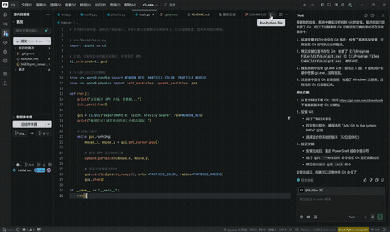

# Experiment 0

本项目是计算机图形学课程的实验，通过使用Taichi Lang，利用 GPU 并行加速实现了上万个粒子的实时物理仿真与交互。

## 项目简介
本项目模拟了一个简单的“万有引力”系统。用户可以通过移动鼠标产生引力源，吸引屏幕上的粒子群。
* **物理核心**: 每一个粒子的位置和速度更新均在 GPU 上并行完成。
* **交互体验**: 粒子具有惯性、空气阻力以及边界反弹效果。

## 项目架构
项目采用标准 `src` 布局，确保了逻辑与配置的分离：
* `src/Work0/config.py`: **参数配置中心**。存放粒子总数 ($10,000$)、引力强度 ($0.001$)、颜色等硬编码参数。
* `src/Work0/physics.py`: **GPU 核心逻辑区**。使用 `@ti.kernel` 定义并行算子，处理粒子运动学计算。
* `src/Work0/main.py`: **程序入口与视图层**。负责渲染主循环和 GUI 交互。
* `pyproject.toml`: 项目依赖配置文件。

## 代码实现逻辑
1. **数据结构**: 使用 `ti.Vector.field` 在显存中开辟空间存储粒子的位置 `pos` 和速度 `vel`。
2. **物理更新**:
   - 计算粒子与鼠标的距离 $\text{dist}$。
   - 施加引力：$\vec{v} = \vec{v} + \text{dir}_{normalized} \times \text{GRAVITY}$。
   - 考虑阻力与边界反弹：当粒子坐标超出 $[0, 1]$ 范围时，速度反向并乘以损耗系数 `BOUNCE_COEF`。

## 效果展示

