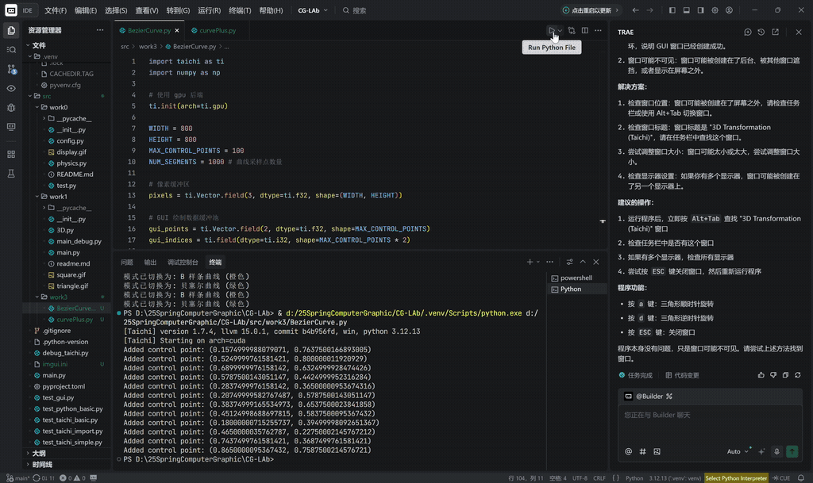
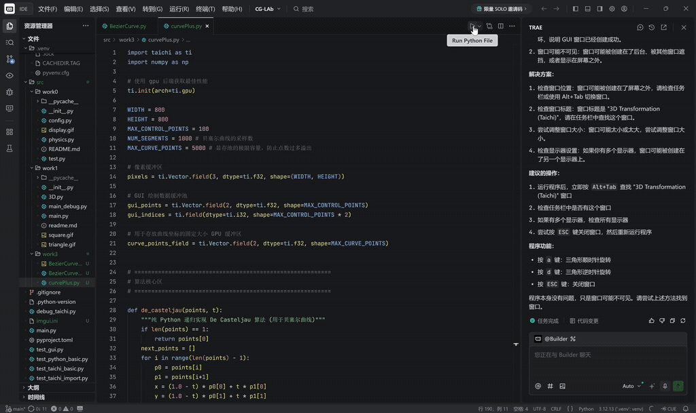

# Experiment 3

本项目通过使用 Taichi Lang 在 GPU 上实现了经典的 **Bézier 曲线** 绘制，并完成了 **反走样 (Anti-Aliasing)** 与 **均匀三次 B 样条 (B-Spline)** 的选做挑战。

## 项目简介
本项目探索了从离散控制点生成连续平滑曲线的数学过程。通过手动操作像素缓冲区（Frame Buffer），实现了高效的曲线光栅化。
* **算法核心**: 基础任务采用 **De Casteljau 算法** 进行递归线性插值；选做任务引入了 **三次 B 样条基矩阵** 运算。
* **渲染突破**: 实现了亚像素级的 **抗锯齿渲染**，通过 $3 \times 3$ 邻域的高斯距离衰减模型，消除了曲线的阶梯状走样。
* **交互特性**: 支持实时交互，用户可动态添加控制点，并能在贝塞尔模式与 B 样条模式间一键切换，直观对比“全局控制”与“局部控制”的差异。

## 项目架构
项目延续标准 `src` 布局，包含基础与进阶两个版本：
* `src/work3/BezierCurve.py`: **必做**。实现了标准的贝塞尔曲线生成与像素点亮逻辑。
* `src/work3/curvePlus.py`: **选做**。集成了反走样算法与 B 样条曲线切换功能。

## 代码实现逻辑
1. **De Casteljau 递归**: 
   对于给定的参数 $t \in [0, 1]$ ，通过 $n$ 层线性插值 $P'_i = (1-t)P_i + tP_{i+1}$ 最终确定曲线上的一点。
2. **反走样光栅化 (选做)**:
   计算插值生成的浮点坐标与周围 $3 \times 3$ 像素中心的欧几里得距离，利用高斯衰减函数 $W = \exp(-dist^2 \times 1.5)$ 分配颜色权重，实现边缘平滑。
3. **B 样条基矩阵 (选做)**:
   利用均匀三次 B 样条基矩阵 $M$ ，通过 $T \times M \times P$ 的矩阵乘法快速计算分段曲线，克服了贝塞尔曲线“动一点而发全身”的局限性。

## 运行与操作说明
在项目根目录下，使用 `uv` 运行对应脚本：


## 效果展示

### 1. 必做


### 2. 选作

```bash
