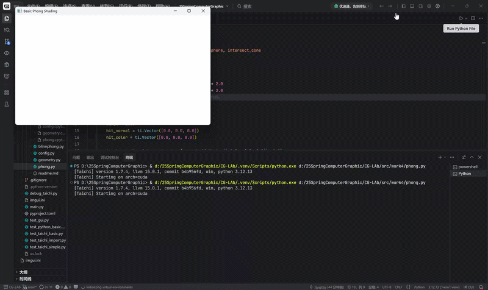
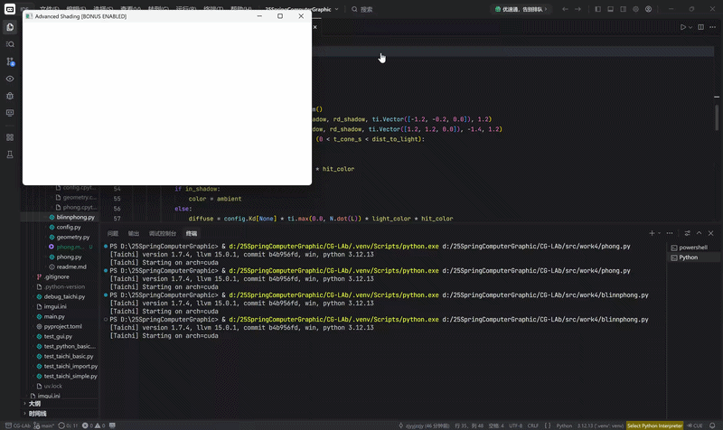

# 实验四：局部光照模型与光线投射渲染

## 项目简介
本项目基于 **Taichi Lang** 编程语言，在 GPU 架构上从零实现了一个基于光线投射（Ray Casting）的 3D 实时渲染引擎。实验脱离了传统的光栅化管线，直接在三维空间中通过数学隐式方程定义了几何体（球体与圆锥），并计算每条屏幕射线与物体的物理交点，真实还原了光的三维传播过程。

完成基础 Phong 光照模型的基础上，还增加了以下功能以完成选做题的Blinn-Phong ：
1. **Blinn-Phong 模型升级**：引入半程向量（Halfway Vector），从物理光学近似的角度，完美解决了经典 Phong 模型在物体边缘掠射角（Grazing Angle）处产生的高光截断断层问题。
2. **硬阴影光线追踪 (Hard Shadows)**：在光线命中物体后，二次发射“暗影射线 (Shadow Ray)”进行光源可见性测试，实现了极其真实的物体间遮挡关系。
3. **响应式 UI 与宽屏自适应**：重构了底层的视口映射逻辑，支持 16:9 高清宽屏渲染，并实现了 UI 面板的相对坐标动态锚定，彻底消除了拉伸变形。

## 项目架构

| 文件路径 | 功能描述 |
| :--- | :--- |
| `src/work4/config.py` | **【全局配置】** 集中管理 GPU 显存分配、16:9 视口分辨率定义及 UI 交互状态树。 |
| `src/work4/geometry.py` | **【数学算法库】** 纯函数库。封装了向量归一化、反射公式以及光线与球体/圆锥的联立求交算子。 |
| `src/work4/phong.py` | **【必做】** 基础演示。包含标准的 Phong 局部光照计算，无遮挡与阴影逻辑。 |
| `src/work4/blinnphong.py` | **【选作】** 进阶展示。完成Blinn-Phong 动态切换，然后把 UI 界面的比例改成比较好看的16：9。 |

## 3. 代码实现逻辑

1. **核心算法一：光线求交与深度测试 (Ray Intersection)**：为屏幕上的每一个像素发射一条射线 $\mathbf{r}(t) = \mathbf{o} + t\mathbf{d}$。
2. **核心算法二：球光照求交与深度测试 (Shading Model)**：
    - **球体求交**：将射线代入球面隐式方程，提取一元二次方程的系数 $A, B, C$，通过判别式 $\Delta$ 求解最小正根 $t$。
    - **圆锥求交**：将世界坐标变换至以圆锥顶点为原点的局部坐标系，联立圆锥曲面方程求得交点后，额外增加高度裁剪逻辑 $y \in [-H, 0]$ 以截断无限延伸的锥体。
    - **深度竞争 (Z-Buffer)**：维护一个全局 `min_t`，仅保留距离摄像机最近的交点数据，以确保正确的空间遮挡关系。

3. **核心算法三：局部光照着色器 (Shading Model)**：
在找到最近交点 $\mathbf{p}$ 与法线 $\mathbf{N}$ 后，计算环境光 (Ambient)、漫反射 (Diffuse) 与镜面高光 (Specular)：
    - **标准 Phong 模型**：高光强度取决于反射向量 $\mathbf{R}$ 与视线向量 $\mathbf{V}$ 的点乘 $(\mathbf{R} \cdot \mathbf{V})^n$。当夹角大于 90 度时，点乘为负，会导致高光瞬间消失（视觉截断缺陷）。
    - **Blinn-Phong 模型 (选做)**：计算光源 $\mathbf{L}$ 与视线 $\mathbf{V}$ 的半程向量 $\mathbf{H} = \text{normalize}(\mathbf{L} + \mathbf{V})$。高光强度改为 $(\mathbf{N} \cdot \mathbf{H})^n$。由于 $\mathbf{H}$ 始终处于有效象限，完美解决了大入射角下的高光断层。

4. **核心算法四：硬阴影射线追踪 (Shadow Ray)**：
在计算出光照前，从交点 $\mathbf{p}$ 向光源位置发射一条二次射线。
    - **逻辑判定**：若该射线在距离小于 `dist_to_light` 的范围内击中了任何其他几何体，则将标志位 `in_shadow` 设为 True，此时屏蔽漫反射和高光，仅保留底色的环境光。
    - **工程坑点防范 (Shadow Acne)**：为避免浮点数精度误差导致射线击中自身表面产生黑色噪点，本项目将阴影射线的起点沿表面法线微微抬升了 $10^{-4}$ 个单位：
    $$
    \mathbf{p}_{shadow} = \mathbf{p} + \mathbf{N} \times 10^{-4}
    $$

## 效果展示
### 1. 必做：标准 Phong 模型演示

### 2. 选作：Blinn-Phong 模型演示
