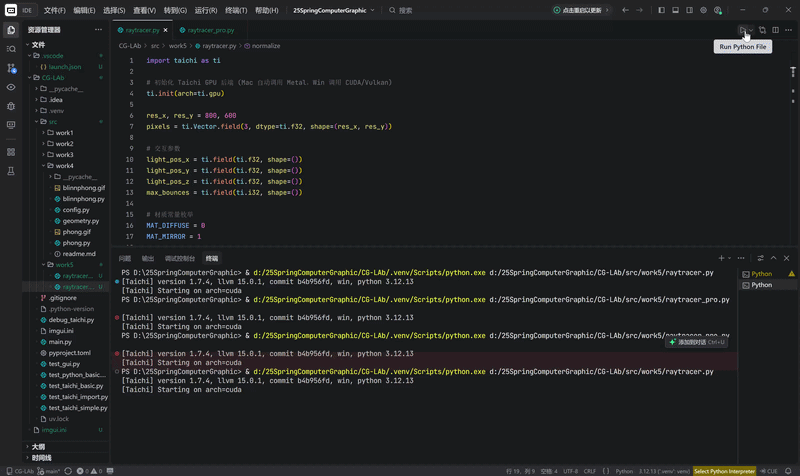
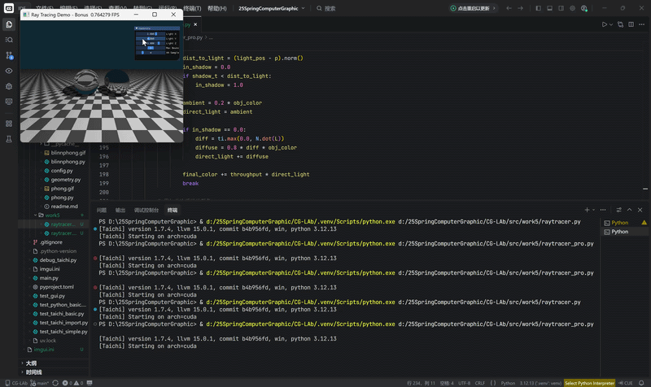

# 实验五：全局光照模型与光线追踪渲染

## 项目简介
本项目基于 **Taichi Lang** 编程语言，在 GPU 架构上实现了一个基于经典 Whitted-Style 的光线追踪（Ray Tracing）渲染器。本实验从局部光照（实验四）跨越到全局光照，通过追踪光线在三维空间中的多次弹射，真实模拟了镜面反射与阴影遮挡效果。

在完成基础平面、漫反射与镜面反射物体光线追踪的基础上，还增加了以下功能以完成选做要求：
1. **玻璃材质与物理折射**：引入斯涅尔定律（Snell's Law），实现了光线在不同折射率介质间的穿透，并完美处理了光线试图从密介质射入疏介质时发生的物理全反射（Total Internal Reflection, TIR）现象。
2. **MSAA 多重采样抗锯齿**：摒弃单像素单射线的离散化渲染，在单一像素内部引入随机抖动，发射多条主射线进行随机采样并求取颜色均值，彻底消除了几何体边缘的像素走样（锯齿）问题。

## 项目架构

| 文件路径 | 功能描述 |
| :--- | :--- |
| `src/work5/raytracer_basic.py` | **【必做】** 基础光线追踪演示。隐式定义了棋盘格地板与双球体场景，包含漫反射与纯镜面反射材质、硬阴影测试及基于迭代的多次光线弹射逻辑。 |
| `src/work5/raytracer_bonus.py` | **【选作】** 进阶光线追踪演示。在基础版之上对左侧球体增加了玻璃材质（折射计算），并引入了可动态调节采样率的 MSAA 抗锯齿功能。 |

## 代码实现逻辑

1. **核心算法一：迭代式光线弹射 (Iterative Ray Bouncing)**：
传统的树状递归光线追踪不利于 GPU 的底层并行架构。本项目将其重构为 `for` 循环迭代模式。引入 `throughput`（光线吞吐量/能量衰减系数，初始值为 1.0）。光线每次击中镜面或玻璃物体时，更新原点与方向，并将 `throughput` 乘以对应的反射率，继续下一次循环追踪；若击中漫反射物体，则计算最终光照强度并立即终止（break）弹射循环。

2. **核心算法二：场景求交与材质路由 (Scene Intersection & Material Branching)**：
将当前光线与场景中隐式定义的几何体（无限大平面、球体）进行联立求交，获取最近交点距离 $t$、法线 $\mathbf{N}$ 与材质 ID，并根据材质进入不同分支：
   - **漫反射材质 (Diffuse)**：执行类似于 Phong 模型的直接光照计算。
   - **镜面材质 (Mirror)**：根据反射定律 $\mathbf{R} = \mathbf{L}_{in} - 2(\mathbf{L}_{in} \cdot \mathbf{N})\mathbf{N}$ 计算次级反射射线方向。
   - **玻璃材质 (Glass，选做)**：根据入射光线与法线的点乘正负号判定光线位于球体外部还是内部，动态切换折射率比值 $\eta$。通过斯涅尔公式计算折射向量，若根号内小于零，则触发物理全反射，代码逻辑自动退化并切入纯镜面反射分支。

3. **核心算法三：硬阴影追踪 (Shadow Ray) 与自相交修复**：
在漫反射着色阶段，从当前交点向点光源发射二次射线。若该射线在抵达光源的距离内击中其他物体，则视为被遮挡，此时仅保留基础的环境光分量。
**工程坑点防范 (Shadow Acne)**：由于浮点数存储精度的局限性，从表面发射的次级射线极易立刻与自身表面发生误交，导致画面布满黑色噪点。本项目对所有次级射线（反射、折射、阴影）的起点进行了极小幅度的法线偏移修复：
$\mathbf{p}_{new} = \mathbf{p} \pm \mathbf{N} \times 10^{-4}$
（注：若为表面反射或阴影射线，向法线正方向偏移；若为玻璃内部折射射线，则向法线反方向缩进以确保光线进入介质内部）。

4. **核心算法四：MSAA 抗锯齿 (Multi-Sample Anti-Aliasing，选做)**：
在外层像素遍历环节加入了一层采样循环。计算屏幕映射坐标 $(u, v)$ 时，叠加了一个介于 0 到 1 之间的 `ti.random()` 随机微小偏移量。单次光线追踪结束后，累加获取的颜色，最终除以总采样次数。通过数学平均值柔化了锐利的边界像素。

## 效果展示
### 1. 必做：基础光线追踪演示 (镜面反射与硬阴影)

### 2. 选作：进阶光线追踪演示 (玻璃折射与 MSAA 抗锯齿)
