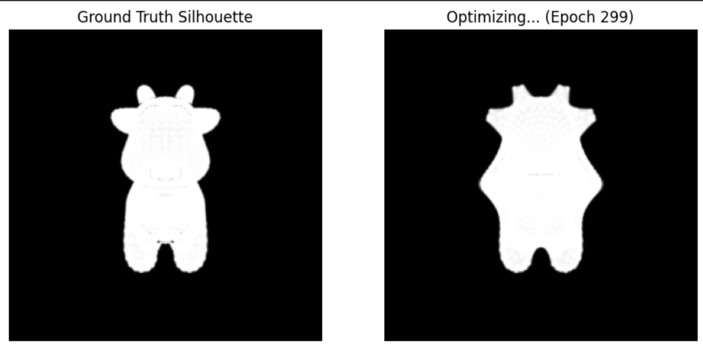
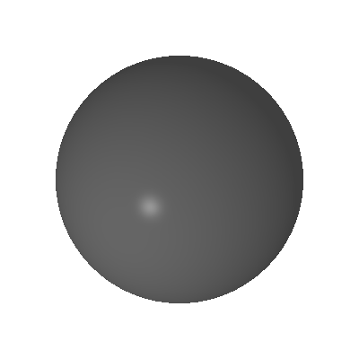

# 202411081103 张瑾瑜 计算机科学与技术
# 实验六：可微渲染

## 项目简介

本实验围绕“可微渲染”展开，主要目标是利用 PyTorch3D 提供的可微光栅化和自动求导机制，将一个初始球体网格逐步优化为目标奶牛模型的形状。与传统渲染只负责“由三维模型生成二维图像”不同，可微渲染可以根据渲染图像与目标图像之间的误差，将梯度反向传播到三维网格顶点、纹理颜色等参数上，从而实现由二维监督信号反推三维几何结构的过程。

本实验完成了必做和选作两部分内容。必做部分是基于剪影的球体到奶牛形状优化，即使用目标奶牛模型在多个视角下的剪影图作为监督信号，以一个初始球体作为源模型，通过不断优化球体顶点偏移量，使其多视角剪影逐渐接近目标奶牛剪影。选作部分是在形状优化的基础上进一步加入 RGB 图像监督，同时优化网格顶点坐标和顶点颜色或纹理信息，使最终结果不仅在轮廓上接近奶牛，而且在颜色外观上也更接近目标模型。

本实验的主要目标包括：

- 理解并掌握可微光栅化的基本原理，特别是在处理离散几何体 Mesh 边界时的数学近似方法。
- 掌握如何通过多视角二维图像，包括剪影图和 RGB 图像，反向优化三维空间中的网格顶点坐标。
- 理解网格优化过程中正则化的重要作用，认识到拉普拉斯平滑、边长约束和法线一致性对于防止网格拓扑崩坏、减少尖刺和避免局部最优的重要意义。
- 完成基于剪影的形状优化，并进一步完成联合纹理优化，使模型同时具备形状和外观上的优化效果。

通过本实验，可以更直观地理解可微渲染在三维重建、图像反演、神经渲染和三维视觉任务中的基本思想：先将三维模型渲染为二维图像，再根据二维图像误差反向更新三维模型参数。


## 代码实现逻辑

本实验的核心思想是：不直接手工修改球体的形状，而是将球体每个顶点的偏移量设置为可学习参数，通过梯度下降自动优化这些偏移量，使球体在多个视角下的渲染结果逐渐接近目标奶牛模型。

实验首先加载目标奶牛网格，并设置一组围绕物体的相机视角。为了避免单一视角带来的形状歧义，代码从多个角度渲染目标奶牛模型，得到一组参考剪影图像。多视角监督可以让优化过程同时考虑前后、左右等不同方向的轮廓信息，从而使最终三维形状更加完整。

在必做部分中，目标是让源球体的剪影接近目标奶牛的剪影。代码中使用 PyTorch3D 的软光栅化器构建剪影渲染管线。传统硬光栅化中，像素只有“在三角形内”和“不在三角形内”两种状态，这种离散判断不利于反向传播。而软光栅化会在三角形边界附近生成平滑过渡，使边界处也能够产生有效梯度。

软光栅化可以理解为利用像素到三角形边界的距离计算一个连续概率值：

$$
A(d)=\text{sigmoid}\left(\frac{d}{\sigma}\right)
$$

其中，$d$ 表示像素到三角形边缘的距离，$\sigma$ 控制边缘过渡的平滑程度。当 $\sigma$ 较大时，边界更加模糊，梯度范围更宽；当 $\sigma$ 较小时，边界更加清晰，但优化过程可能更不稳定。

随后使用相同的相机参数分别渲染目标奶牛模型和当前优化中的球体模型，并计算二者剪影之间的均方误差：

$$
L_{silhouette}=\frac{1}{N}\sum_{i=1}^{N}(S_i^{pred}-S_i^{target})^2
$$

其中，$S_i^{pred}$ 表示当前模型在第 $i$ 个视角下的预测剪影，$S_i^{target}$ 表示目标奶牛模型在第 $i$ 个视角下的参考剪影。通过多视角共同约束，可以减少单视角优化带来的形状歧义，使三维网格的整体轮廓更加接近目标奶牛。

在网格形变部分，代码并不是直接修改源球体的顶点坐标，而是定义一个可学习的顶点偏移量 `deform_verts`：

```python
src_mesh = ico_sphere(4, device)
deform_verts = torch.zeros_like(src_mesh.verts_packed(), requires_grad=True)
```

每一轮迭代中，通过 `offset_verts` 将当前偏移量作用到源球体上：

```python
new_src_mesh = src_mesh.offset_verts(deform_verts)
```

这样做的好处是可以保留初始球体网格结构，同时只优化顶点的相对位移。优化器会根据损失函数的梯度不断调整 `deform_verts`，最终使球体逐渐变形为类似奶牛的形状。

但是，如果只使用剪影损失，顶点可能会为了拟合某几个视角的轮廓而出现严重拉伸、交叉或尖刺，导致网格表面不平滑，甚至产生不合理的拓扑结构。因此，本实验在图像损失之外加入了网格正则化项，主要包括三类：

- **拉普拉斯平滑损失 `L_lap`**：约束每个顶点与其邻域顶点之间的位置关系，防止局部顶点过度突出，使网格表面更加平滑。
- **边长一致性损失 `L_edge`**：约束网格边的长度不要变化过大，防止三角形被过度拉伸或压缩，保持网格结构的稳定性。
- **法线一致性损失 `L_normal`**：约束相邻三角形面的法线方向尽量一致，减少表面折皱和不自然突变，提升模型整体表面的连续性。

因此，必做部分的总损失函数为：

$$
L_{total}=L_{silhouette}+w_{lap}L_{lap}+w_{edge}L_{edge}+w_{normal}L_{normal}
$$

其中，$w_{lap}$、$w_{edge}$ 和 $w_{normal}$ 分别表示三种正则化项的权重。实际实验中需要合理调节这些权重。如果正则化权重过小，模型容易出现尖刺和局部畸变；如果正则化权重过大，模型又会过于接近初始球体，难以充分变形为奶牛形状。

优化过程使用 Adam 优化器完成。每次迭代的基本逻辑如下：

```python
optimizer.zero_grad()

new_src_mesh = src_mesh.offset_verts(deform_verts)
images_predicted = renderer_silhouette(new_src_mesh, cameras=cameras)

loss_silhouette = ((images_predicted[..., 3] - target_silhouettes) ** 2).mean()
loss_laplacian = mesh_laplacian_smoothing(new_src_mesh)
loss_edge = mesh_edge_loss(new_src_mesh)
loss_normal = mesh_normal_consistency(new_src_mesh)

loss = (
    loss_silhouette
    + w_lap * loss_laplacian
    + w_edge * loss_edge
    + w_normal * loss_normal
)

loss.backward()
optimizer.step()
```

在选作部分中，实验进一步加入了纹理优化。相比必做部分只关注黑白剪影，联合纹理优化需要同时比较渲染结果与目标 RGB 图像之间的颜色差异。因此，渲染器从剪影渲染器扩展为带光照和颜色计算的 `SoftPhongShader`。

选作部分的优化目标不仅包括形状损失，还包括颜色损失：

$$
L_{rgb}=\frac{1}{N}\sum_{i=1}^{N}(I_i^{pred}-I_i^{target})^2
$$

其中，$I_i^{pred}$ 表示当前模型在第 $i$ 个视角下的预测 RGB 图像，$I_i^{target}$ 表示目标奶牛模型在同一视角下的参考 RGB 图像。

联合优化时，总损失可以表示为：


L_{total}=L_{silhouette}+w_{rgb}L_{rgb}+w_{lap}L_{lap}+w_{edge}L_{edge}+w_{normal}L_{normal}


其中，$w_{rgb}$ 用于控制 RGB 颜色损失在总损失中的占比。通过同时优化顶点形变和顶点颜色，模型不仅能够学习奶牛的外部轮廓，还能够逐渐拟合目标模型的表面颜色分布。

完整的联合优化逻辑可以概括为：

```text
输入：目标奶牛模型、源球体模型、多视角相机参数

1. 渲染目标奶牛的剪影图和 RGB 图像
2. 初始化源球体的顶点偏移量 deform_verts
3. 初始化源球体的顶点颜色或纹理参数
4. 使用当前 deform_verts 得到变形后的源网格
5. 渲染当前网格的剪影图和 RGB 图像
6. 计算剪影损失、RGB 损失和网格正则化损失
7. 对总损失进行反向传播
8. 使用优化器更新顶点偏移量和纹理参数
9. 重复迭代，直到结果收敛
10. 保存最终图像、模型和优化过程动图
```

## 效果展示

### 1. 必做：基于剪影的球体到奶牛形状优化



### 2. 选作：联合纹理优化结果



---

## 实验结果分析

本实验最终完成了必做的剪影优化任务和选作的联合纹理优化任务。整体来看，实验结果能够较好地体现可微渲染的核心思想：通过二维图像中的误差信号反向优化三维模型参数。

在必做部分中，球体经过多轮迭代后逐渐产生明显形变，整体轮廓开始接近奶牛模型。这个过程说明软光栅化确实能够为网格顶点提供有效梯度。如果使用传统硬光栅化，像素边界处的离散变化很难直接用于梯度下降，而软光栅化通过边界模糊化让剪影变化变得连续，从而使顶点能够根据剪影误差进行更新。

不过，基于剪影的优化也存在一定局限。剪影本质上只包含物体在不同视角下的外轮廓信息，无法直接提供完整的三维表面结构信息。因此，当某些局部结构在多个视角中不够明显时，模型可能只能恢复大致形状，而难以精确恢复细节。例如奶牛的腿部、头部和尾部等区域相对细长，优化时更容易受到正则化项的限制，最终结果可能会比目标模型更加圆滑。

在实验过程中，正则化项对结果质量影响非常明显。如果只依赖剪影损失，网格会为了快速贴合二维轮廓而出现局部尖刺、表面折叠或三角形严重拉伸的问题。这种结果虽然可能在某些视角下剪影误差较小，但三维结构本身并不合理。加入拉普拉斯平滑、边长一致性和法线一致性之后，模型表面更加连续，形变过程也更加稳定。由此可以看出，三维网格优化不能只关注图像层面的误差，还必须考虑几何结构本身的合理性。

选作部分的联合纹理优化进一步提升了实验效果。相比只优化剪影，RGB 损失提供了更丰富的监督信息，使模型能够学习目标奶牛的表面颜色分布。虽然纹理优化结果仍然会受到光照、相机视角、网格精度和优化轮数等因素影响，但整体上已经能够体现出从“只有形状”到“形状与外观共同优化”的改进。

从优化难度来看，联合纹理优化比剪影优化更加复杂。剪影优化主要关注透明度通道或二值轮廓，目标相对单一；而 RGB 优化同时受到几何、颜色、光照和遮挡关系的影响。如果形状尚未优化到较好位置，RGB 损失可能会受到错误投影的影响，从而导致颜色学习不稳定。因此，在实验中先进行剪影形状优化，再加入纹理优化，是一种比较合理的实现方式。

本实验还说明，多视角监督在三维形状优化中非常重要。单一视角只能约束模型在某一个方向上的投影，可能会导致模型在其他方向上严重变形。通过从多个角度同时计算损失，模型需要在不同视角下都接近目标奶牛，从而减少形状歧义，提高三维结构的合理性。

总体而言，本实验较完整地验证了可微渲染的基本流程。必做部分实现了基于剪影的三维网格形变优化，选作部分进一步实现了形状与纹理的联合优化。通过实验可以更直观地理解，三维视觉任务中的“渲染”不只是一个前向生成图像的过程，也可以成为连接二维监督和三维参数优化的重要桥梁。