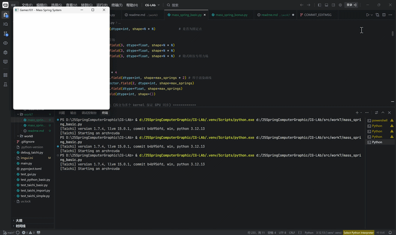
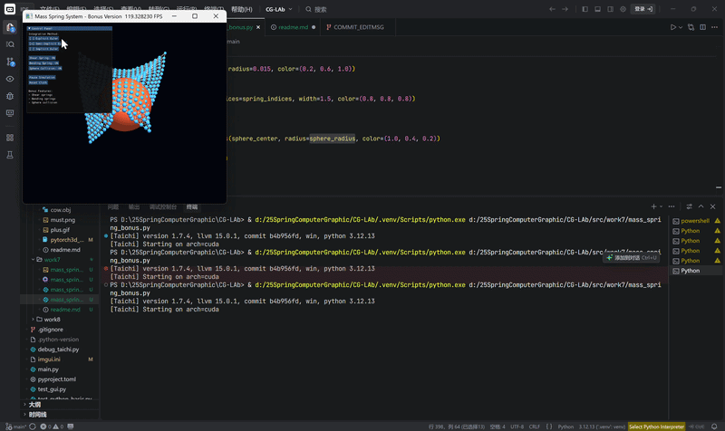

# 计算机图形学实验七：质点弹簧模型

## 项目简介

本实验围绕 **质点-弹簧模型（Mass-Spring Model）** 展开，使用 Taichi 框架实现了一个三维布料模拟系统。实验中将布料离散化为规则网格上的质点集合，并在质点之间建立弹簧连接，从而模拟布料在重力、弹簧力和阻尼力共同作用下的动态形变过程。

在物理模拟部分，本实验实现了结构弹簧的受力计算，并通过阻尼力和速度钳制缓解数值爆炸问题。在数值积分部分，分别实现了显式欧拉、半隐式欧拉和隐式欧拉三种积分方法，用于比较不同积分方式在物理模拟中的稳定性差异。

在渲染与交互部分，本实验使用 Taichi GGUI 构建三维场景，绘制布料质点和弹簧线框，并提供控制面板用于切换积分方法、暂停模拟和重置布料。选作部分进一步加入剪切弹簧、弯曲弹簧和球体碰撞，使布料模拟效果更加完整。

本实验完成内容包括：

* 必做部分：结构弹簧、三种积分方法、速度钳制、GGUI 交互控制。
* 选作部分：剪切弹簧、弯曲弹簧、球体碰撞。

---

## 项目架构

本实验项目文件结构如下：

```text
work7/
├── mass_spring_basic.py
├── mass_spring_basic.gif
├── mass_spring_bonus.py
├── mass_spring_bonus.gif
└── readme.md
```

各文件说明如下：

* `mass_spring_basic.py`：必做版本，实现结构弹簧、三种积分方法、速度钳制和基础 GGUI 交互。
* `mass_spring_basic.gif`：必做版本的运行效果展示。
* `mass_spring_bonus.py`：选作版本，在必做基础上加入剪切弹簧、弯曲弹簧和球体碰撞。
* `mass_spring_bonus.gif`：选作版本的运行效果展示。
* `readme.md`：实验说明文档。

---

## 代码实现逻辑

本实验的核心实现逻辑可以分为五个部分：场景初始化、力学计算、数值积分、碰撞处理和 GGUI 渲染交互。

首先，程序定义布料网格大小，例如 `20 x 20`，每个网格点对应一个质点。每个质点拥有位置 `x`、速度 `v`、受力 `f` 和固定状态 `is_fixed`。初始化时，布料被放置在三维空间中的一个平面上，并固定布料上边两个角点，使布料可以在重力作用下自然下垂。

为了保证 GPU 计算状态同步，初始化过程被拆分为多个 `@ti.kernel`，包括位置初始化、弹簧初始化和渲染索引初始化，并在 Python 层按顺序调用：

```python
def init_cloth():
    num_springs[None] = 0
    init_positions()
    init_springs()
    init_spring_indices()
```

这样可以避免不同初始化阶段之间的数据尚未同步就被后续 Kernel 使用，保证 GPU 并行计算中的状态一致性。

在力学计算部分，代码使用 `compute_forces_on()` 函数计算重力、阻尼力和弹簧力。重力作用于所有质点，阻尼力用于削弱系统能量，弹簧力根据胡克定律计算。由于多个弹簧可能同时向同一个质点累加受力，因此弹簧力累加时使用 `ti.atomic_add` 避免并行写入冲突：

```python
ti.atomic_add(force[idx_a], f_spring)
ti.atomic_add(force[idx_b], -f_spring)
```

为了防止显式欧拉等不稳定方法出现严重数值爆炸，代码实现了 `clamp_velocity()` 函数。当质点速度超过最大速度阈值时，将其缩放回允许范围内，从而避免布料瞬间飞出场景。速度钳制虽然不能从根本上改变积分方法的稳定性，但可以有效提高实验过程的可控性。

在积分求解器部分，代码分别实现了三个核心 Kernel：

```python
step_explicit()
step_semi_implicit()
step_implicit_iter()
```

显式欧拉先使用旧速度更新位置，再使用旧受力更新速度：

```python
x[i] += v[i] * dt
v[i] += (f[i] / mass) * dt
```

这种方法实现简单，但对时间步长和弹簧刚度较敏感，容易产生数值不稳定。

半隐式欧拉先更新速度，再使用更新后的速度更新位置：

```python
v[i] += (f[i] / mass) * dt
x[i] += v[i] * dt
```

相比显式欧拉，半隐式欧拉在相同参数下通常更加稳定，因此更适合实时物理模拟。

隐式欧拉使用未来状态计算受力，本实验中通过定点迭代进行近似求解。每次迭代中先根据预测位置和速度重新计算受力，再更新预测速度和预测位置，最后将迭代后的状态写回原始场。该方法具有更强的稳定性，但会带来更明显的数值阻尼。

选作部分在基础结构弹簧之外增加了两类弹簧。剪切弹簧连接对角线方向的相邻质点，用于抵抗布料斜向变形；弯曲弹簧连接间隔一个质点的远邻点，用于减少布料局部过度折叠，使表面更加平滑。

选作部分还加入了球体碰撞。程序在每次物理更新后判断质点是否进入球体内部。如果质点到球心的距离小于球半径，则将该质点投影回球面，并修正其速度方向，从而实现简单的空间碰撞效果。

最后，程序使用 Taichi 的 `ti.ui.Window` 创建 GGUI 窗口，使用 `scene.particles()` 绘制布料质点，使用 `scene.lines()` 绘制弹簧线框。控制面板提供积分方法切换、暂停、重置等功能；在选作版本中，还可以开关剪切弹簧、弯曲弹簧和球体碰撞。

---

## 效果展示

### 1. 必做：基础质点弹簧模型



### 2. 选作：扩展弹簧与球体碰撞



---

## 实验结果分析

本实验最终实现了基于 Taichi 的三维质点-弹簧布料模拟系统，并完成了三种积分方法的对比。整体来看，实验结果能够较好地体现质点-弹簧模型在布料模拟中的基本思想。

在物理建模方面，布料被离散为规则网格质点，相邻质点之间通过弹簧连接。重力使布料自然下垂，弹簧力维持质点之间的相对距离，阻尼力削弱系统能量，使布料运动逐渐稳定。通过这种方式，可以使用较简单的模型模拟出布料的弹性形变效果。

在积分方法对比方面，显式欧拉、半隐式欧拉和隐式欧拉表现出了明显差异。显式欧拉只依赖当前状态进行预测，实现最简单，但稳定性最差。当弹簧劲度较大时，即使时间步长较小，也更容易出现抖动或发散。半隐式欧拉先更新速度再更新位置，在相同参数下通常比显式欧拉更加稳定，因此更适合实时物理模拟。隐式欧拉使用未来状态计算受力，理论稳定性更强，本实验中采用定点迭代近似求解后，整体运动更加平滑，但也会带来更明显的数值阻尼。

在数值稳定性处理方面，速度钳制发挥了重要作用。质点-弹簧系统对时间步长和弹簧刚度较敏感，如果速度无限增大，就会导致模拟画面迅速崩坏。通过限制最大速度，可以避免显式欧拉等方法在不稳定情况下出现过度爆炸，使实验过程更加可控。

在 GPU 编程方面，本实验通过 Taichi 的 `ti.kernel` 和 `ti.func` 实现并行计算。初始化过程被拆分为多个 Kernel，并在 Python 层按顺序调用，以保证 GPU 状态同步。力学计算中使用 `ti.atomic_add` 处理多个弹簧同时累加到同一质点受力的问题，避免并行写入冲突。同时，将受力计算和积分更新合并到同一个 Kernel 中，减少了每帧循环中的 Kernel 启动次数，提高了运行效率。

选作部分中，剪切弹簧和弯曲弹簧进一步改善了布料模拟效果。剪切弹簧增强了布料抵抗斜向变形的能力，弯曲弹簧使布料表面更加平滑，减少了局部过度折叠。球体碰撞则让布料能够与场景中的简单障碍物发生交互，使模拟结果更加接近真实布料运动。

总体而言，本实验较完整地实现了一个基于物理的布料模拟系统。实验表明，布料模拟不仅依赖弹簧力、阻尼力等物理建模，还强烈依赖数值积分方法和稳定性控制。不同积分方法会显著影响模拟效果，而合理的弹簧结构、阻尼设置和防爆处理能够有效提升系统稳定性和视觉表现。
