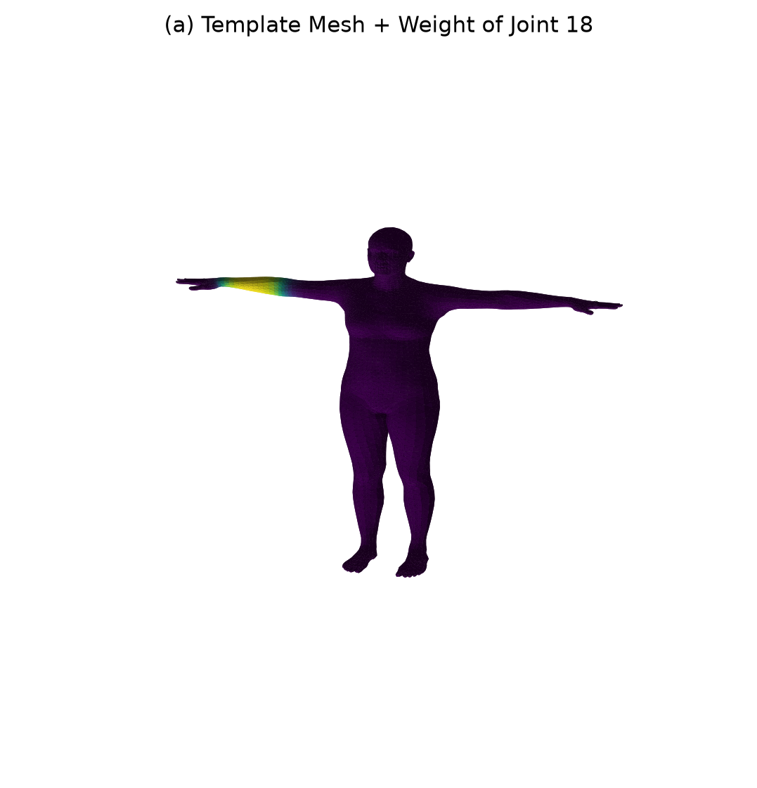
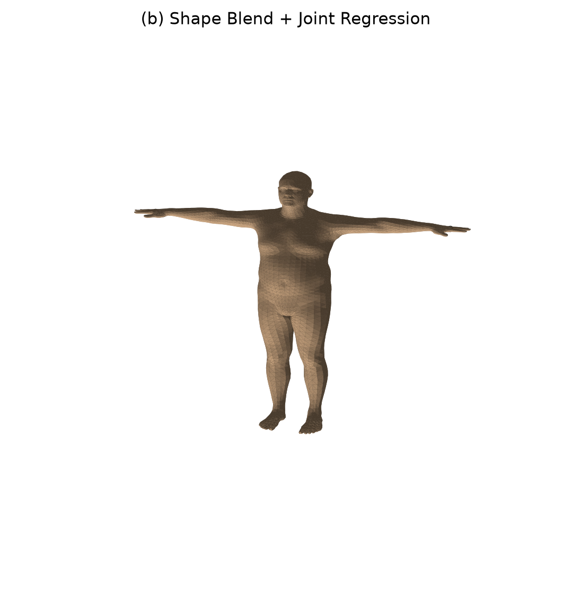
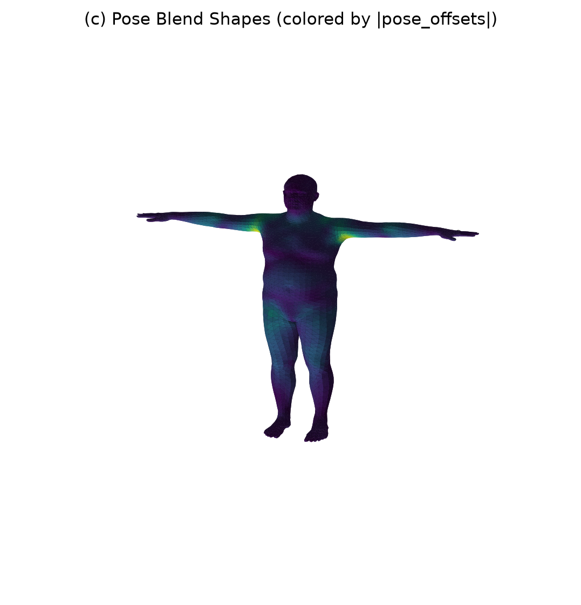
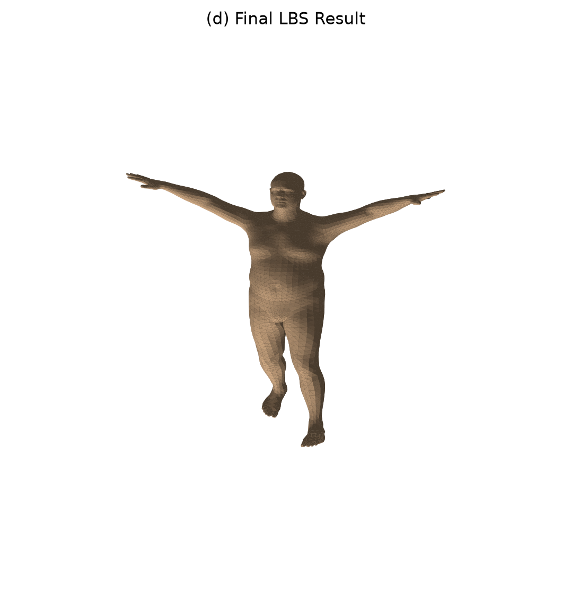
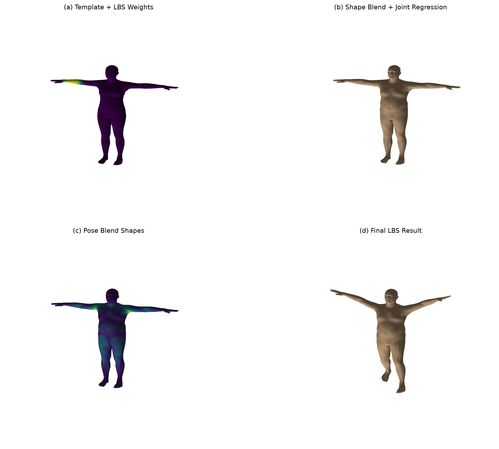
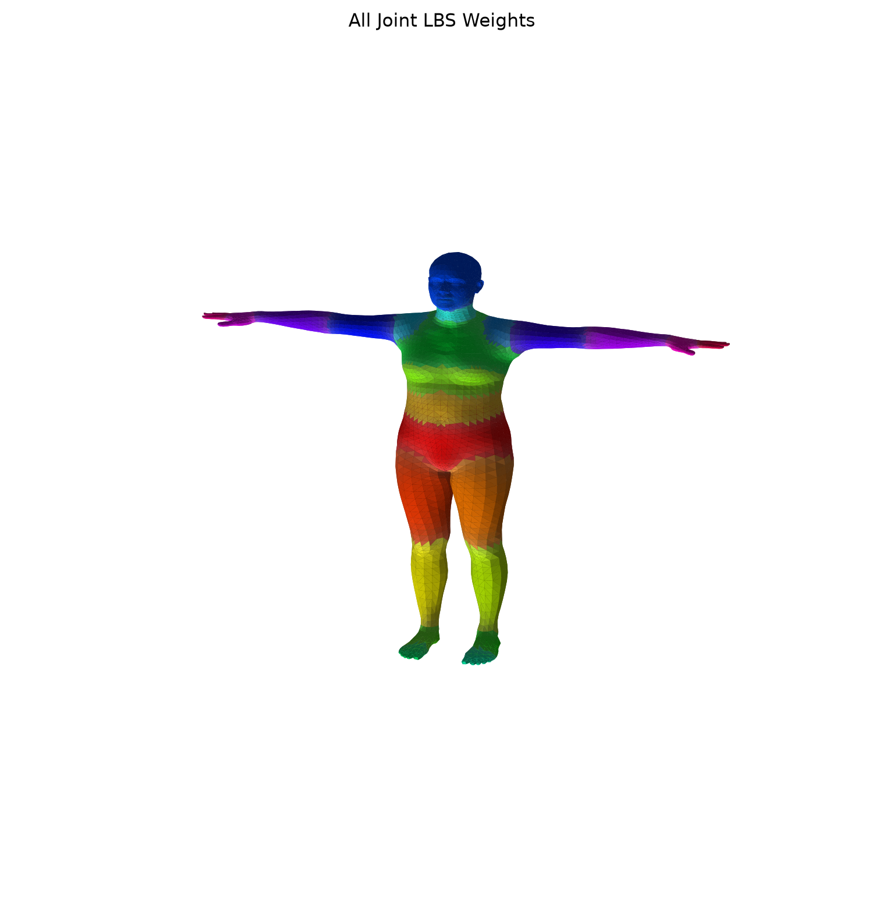

# 202411081103 张瑾瑜 计算机科学与技术
# 计算机图形学实验八：LBS 蒙皮

## 项目简介

本实验围绕 **LBS（Linear Blend Skinning，线性混合蒙皮）** 展开，基于 SMPL 参数化人体模型实现了一次完整的 LBS 蒙皮过程可视化。实验中通过调用 SMPL 模型，提取官方 `lbs()` 实现中的关键中间变量，并分别可视化模板网格、形状校正、姿态校正和最终蒙皮结果。

SMPL 模型将人体表示为一个带有参数控制的三维网格。模型中包含模板顶点 `v_template`、形状参数 `betas`、姿态参数 `body_pose`、关节回归器 `J_regressor`、姿态校正基 `posedirs` 和蒙皮权重 `lbs_weights` 等核心对象。通过这些参数，可以从静态模板人体逐步得到不同体型、不同姿态下的人体网格。

本实验完成了 LBS 的四个主要阶段：

* 阶段 a：模板网格与蒙皮权重可视化。
* 阶段 b：形状校正后网格与关节回归可视化。
* 阶段 c：姿态相关校正 `pose_offsets` 可视化。
* 阶段 d：完整 LBS 后的最终姿态人体可视化。

此外，实验还实现了手写 LBS 与 SMPL 官方 forward 结果的一致性验证。通过逐顶点比较手写计算结果和官方模型输出结果，验证手写 LBS 实现的正确性。

---

## 项目架构

本实验项目文件结构如下：

```text
work8/
├── run_lbs_lab.py
├── models/
│   └── smpl/
│       └── SMPL_NEUTRAL.pkl
└── outputs/
    ├── stage_a_template_weights.png
    ├── stage_b_shaped_joints.png
    ├── stage_c_pose_offsets.png
    ├── stage_d_lbs_result.png
    ├── comparison_grid.png
    ├── all_joint_weights.png
    └── summary.txt
```

各文件说明如下：

* `run_lbs_lab.py`：实验八主程序，实现 SMPL 加载、LBS 四阶段计算、可视化输出和误差验证。
* `models/smpl/SMPL_NEUTRAL.pkl`：SMPL neutral 模型文件，用于加载参数化人体模型。
* `outputs/stage_a_template_weights.png`：模板网格与指定关节权重热力图。
* `outputs/stage_b_shaped_joints.png`：形状校正后网格与回归关节可视化。
* `outputs/stage_c_pose_offsets.png`：姿态相关校正 `pose_offsets` 可视化。
* `outputs/stage_d_lbs_result.png`：完整 LBS 后的最终姿态结果。
* `outputs/comparison_grid.png`：四个阶段的总对比图。
* `outputs/all_joint_weights.png`：全关节主导权重分布图。
* `outputs/summary.txt`：模型基础信息和手写 LBS 与官方 forward 的误差验证结果。

运行命令如下：

```bash
python run_lbs_lab.py --model-dir ./models --out-dir ./outputs --joint-id 18
```

---

## 代码实现逻辑

本实验的核心实现逻辑可以分为五个部分：SMPL 模型加载、手写 LBS 中间量计算、四阶段可视化、总对比图生成和一致性验证。

首先，程序通过 `smplx.create()` 加载 SMPL neutral 模型，并读取模型中的模板顶点、面片、形状基、姿态基、关节回归器、父子关节层级关系和蒙皮权重等信息。加载完成后，程序输出模型基础信息，包括顶点数、面片数、关节数和使用的 shape 参数维度。

在形状参数设置部分，程序构造非零的 `betas`，使人体体型相对于模板网格发生变化。形状校正通过 `blend_shapes()` 完成：

```python
v_shaped = v_template + blend_shapes(betas, shapedirs)
```

随后，程序使用关节回归器从形状变化后的网格中回归关节位置：

```python
J = vertices2joints(model.J_regressor, v_shaped)
```

这一步说明 SMPL 中的关节位置不是固定常数，而是会随人体形状变化而变化。例如人物变高、变矮、变胖或变瘦时，肩、髋、膝等关节的大致位置也会随之改变。

在姿态参数设置部分，程序构造非零的 `global_orient` 和 `body_pose`，用于模拟抬手、弯肘、腿部弯曲等姿态变化。姿态参数首先通过 `batch_rodrigues()` 从轴角形式转换为旋转矩阵：

```python
rot_mats = batch_rodrigues(full_pose.view(-1, 3)).view(1, -1, 3, 3)
```

然后构造姿态特征：

```python
pose_feature = (rot_mats[:, 1:, :, :] - ident).view(1, -1)
```

再通过 `posedirs` 映射得到姿态相关偏移：

```python
pose_offsets = torch.matmul(pose_feature, posedirs).view(1, -1, 3)
v_posed = v_shaped + pose_offsets
```

这一步对应 SMPL 中的姿态校正项 `B_P(theta)`。它并不是最终骨骼驱动后的结果，而是在真正执行 LBS 前对网格进行额外修正，用于改善肩、肘、膝等弯曲区域的局部形变。

在完整 LBS 阶段，程序首先根据旋转矩阵、关节位置和运动学树计算每个关节的全局刚体变换：

```python
J_transformed, A = batch_rigid_transform(rot_mats, J, model.parents, dtype=dtype)
```

然后根据每个顶点的蒙皮权重 `lbs_weights`，对所有关节变换矩阵进行加权混合：

```python
W = model.lbs_weights.unsqueeze(0).expand(1, -1, -1)
T = torch.matmul(W, A.view(1, num_joints, 16)).view(1, -1, 4, 4)
```

最后，将加权后的变换矩阵作用到姿态校正后的齐次顶点上，得到最终蒙皮结果：

```python
v_posed_homo = torch.cat([v_posed, homogen_coord], dim=2)
v_homo = torch.matmul(T, v_posed_homo.unsqueeze(-1))
verts = v_homo[:, :, :3, 0]
```

这样，每个顶点的最终位置不是只由某一个关节决定，而是由多个关节的变换按照权重线性混合得到。这也是 Linear Blend Skinning 的核心思想。

在可视化部分，程序使用 Matplotlib 的三维绘图功能，将不同阶段的网格、权重、关节和偏移量保存为图片。其中，阶段 a 使用颜色显示指定关节对各顶点的影响权重；阶段 b 显示形状变化后的网格和回归关节；阶段 c 使用颜色表示 `pose_offsets` 的大小；阶段 d 显示最终 LBS 后的人体姿态。程序还生成一张 `comparison_grid.png`，用于直观比较四个阶段之间的差异。

最后，程序调用 SMPL 官方 forward，并使用相同的 `betas`、`global_orient` 和 `body_pose` 计算官方输出顶点。随后，将手写 LBS 得到的 `verts` 与官方 `output.vertices` 逐顶点比较，计算平均绝对误差和最大绝对误差，并将结果保存到 `summary.txt` 中。

---

## 效果展示

### 1. 阶段 a：模板网格与指定关节权重热力图



### 2. 阶段 b：形状校正后网格与关节回归



### 3. 阶段 c：姿态相关校正可视化



### 4. 阶段 d：完整 LBS 后的最终姿态结果



### 5. 四阶段总对比图



### 6. 全关节主导权重分布图



---

## 实验结果分析

本实验成功完成了 SMPL 模型加载、LBS 四阶段中间量提取、阶段结果可视化和手写 LBS 一致性验证。整体来看，实验结果能够较好地体现 LBS 蒙皮过程从模板人体到最终姿态人体的完整计算流程。

在模板网格与蒙皮权重阶段，人体处于标准 T-pose 状态，不同顶点已经携带了对应关节的影响权重。单关节权重热力图显示，指定关节主要影响其附近区域，而远离该关节的区域权重较低。全关节主导权重分布图则进一步展示了整个人体表面被不同关节主导控制的区域划分。该结果说明 SMPL 模板网格虽然尚未发生形状和姿态变化，但已经具备完整的骨骼绑定信息。

在形状校正阶段，非零 `betas` 使人体体型相对于模板网格发生变化。通过 `blend_shapes()` 可以得到形状修正后的 `v_shaped`，再由 `J_regressor` 从 `v_shaped` 中回归出关节位置。这样设计的原因是不同体型人体的关节位置并不完全相同，例如肩宽、腿长、身体厚度发生变化时，关节的大致空间位置也会随之变化。因此，关节位置需要从形状变化后的网格中回归，而不是固定为模板人体中的常数。

在姿态校正阶段，程序将姿态参数转换为旋转矩阵，并通过 `R - I` 构造姿态特征，再利用 `posedirs` 得到 `pose_offsets`。从可视化结果可以看出，姿态相关校正主要集中在肩部、手臂和身体连接处等姿态变化较明显的位置。这说明 SMPL 并不是直接将网格绑定到骨骼后进行刚体旋转，而是在 LBS 前加入了额外的姿态修正，以减轻关节弯曲处的塌陷、折叠和不自然形变。

在最终 LBS 阶段，人体已经由 T-pose 进入设定的目标姿态。该阶段根据运动学树计算每个关节的全局变换矩阵，并利用每个顶点的 `lbs_weights` 对多个关节变换进行线性混合，最终得到蒙皮后的顶点 `verts`。相比只选择最大权重关节的刚性绑定方式，线性混合可以让关节附近的顶点受到多个骨骼共同影响，从而在肩、肘、膝等连接区域形成更加平滑的过渡。

从总对比图可以清楚看到四个阶段之间的区别：阶段 a 展示模板网格和蒙皮权重，阶段 b 展示形状变化和关节回归，阶段 c 展示姿态校正带来的局部偏移，阶段 d 展示完整 LBS 后的最终人体姿态。这四个阶段共同构成了 SMPL 中从参数到最终人体网格的核心计算过程。

在一致性验证方面，实验将手写 LBS 结果与 SMPL 官方 forward 输出进行了逐顶点比较。最终得到的平均绝对误差和最大绝对误差均为 `0.0000000000`。这说明手写实现中的形状混合、关节回归、姿态校正、刚体层级变换和权重混合过程与官方实现保持一致，验证了本实验代码实现的正确性。

总体而言，本实验较完整地复现了 SMPL 模型中的 LBS 蒙皮流程。通过分阶段可视化，可以直观理解 `v_template`、`v_shaped`、`J`、`v_posed` 和 `verts` 之间的区别，也能更清晰地认识到形状参数、姿态参数、关节回归器和蒙皮权重在参数化人体建模中的作用。
